# 📸 GriyaHub - Rangkuman Fitur (Screenshot)

Dokumentasi visual dari setiap fitur aplikasi GriyaHub — Sistem Administrasi Perumahan.

---

## 1. Dashboard

Halaman utama yang menampilkan ringkasan data perumahan secara keseluruhan.

**Fitur:**
- Summary cards: Total Rumah, Total Penghuni, Pemasukan Bulan Ini, Pengeluaran Bulan Ini
- Saldo bulan ini (Pemasukan - Pengeluaran)
- Grafik bar chart Pemasukan vs Pengeluaran per bulan (1 tahun)
- Filter tahun pada grafik

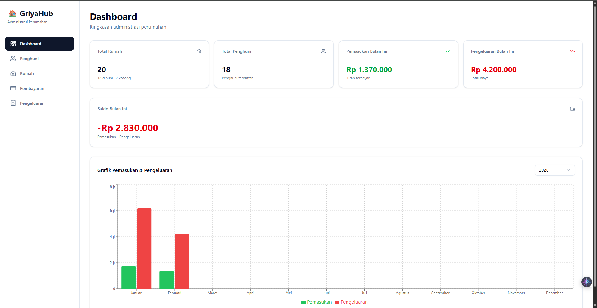

---

## 2. Kelola Penghuni

### 2a. Daftar Penghuni

Menampilkan tabel seluruh penghuni terdaftar di perumahan.

**Fitur:**
- Tabel: Nama, Status (tetap/kontrak), No. Telepon, Status Menikah, Rumah
- Badge warna untuk status penghuni
- Tombol Tambah, Edit, Hapus penghuni

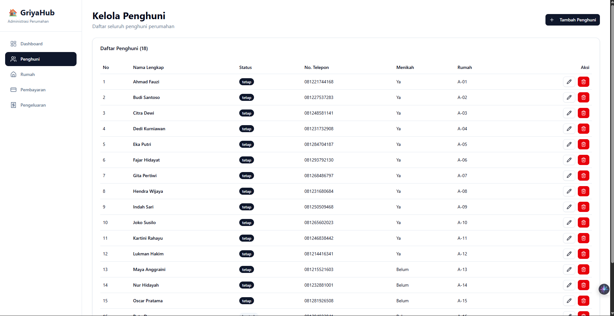

### 2b. Form Tambah/Edit Penghuni

Form untuk menambah atau mengubah data penghuni.

**Fitur:**
- Input: Nama Lengkap, Foto KTP (upload file), Status Penghuni, No. Telepon, Status Menikah
- Validasi input dari backend
- Mode tambah & edit dalam satu komponen

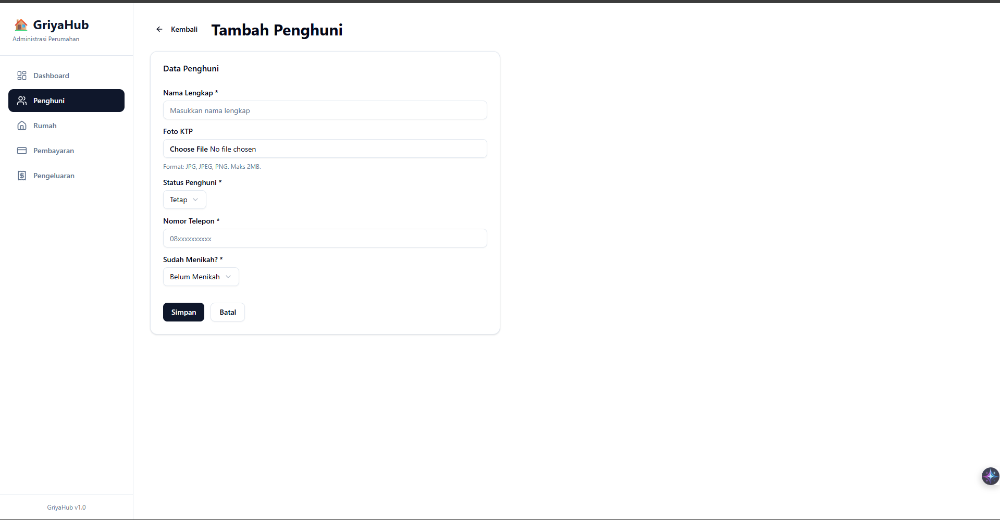

---

## 3. Kelola Rumah

### 3a. Daftar Rumah

Menampilkan grid cards dari semua rumah di perumahan.

**Fitur:**
- Card per rumah: Nomor Rumah, Alamat, Status Hunian (Dihuni/Tidak Dihuni)
- Badge status hunian
- Info penghuni aktif di setiap rumah
- Tombol Lihat Detail

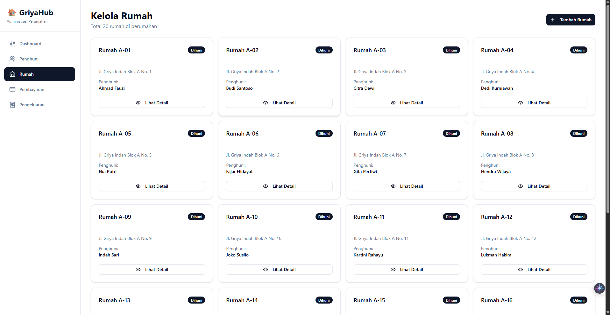

### 3b. Form Tambah Rumah

Form untuk menambahkan rumah baru.

**Fitur:**
- Input: Nomor Rumah (unique), Alamat

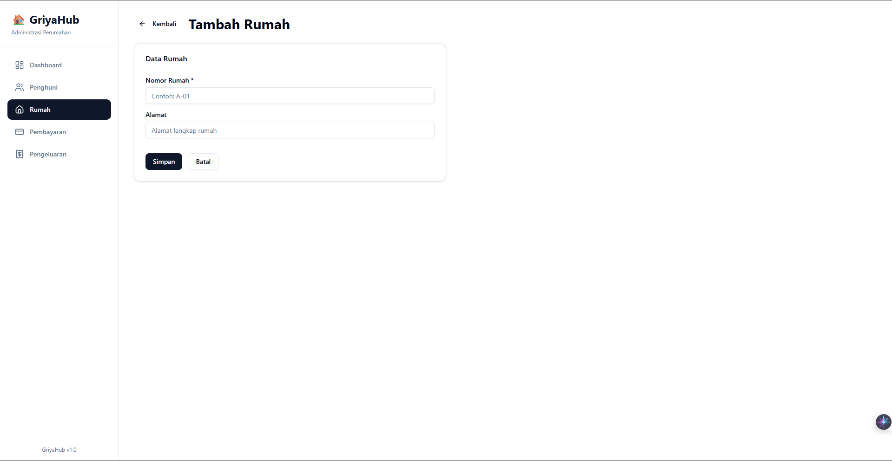

### 3c. Detail Rumah

Halaman detail rumah dengan 3 tab informasi.

**Fitur:**
- **Tab Penghuni Aktif:** Daftar penghuni saat ini, tombol Tambah & Keluarkan penghuni
- **Tab Riwayat Penghuni:** Catatan historis siapa saja yang pernah tinggal
- **Tab Riwayat Pembayaran:** Pembayaran iuran yang terkait rumah ini

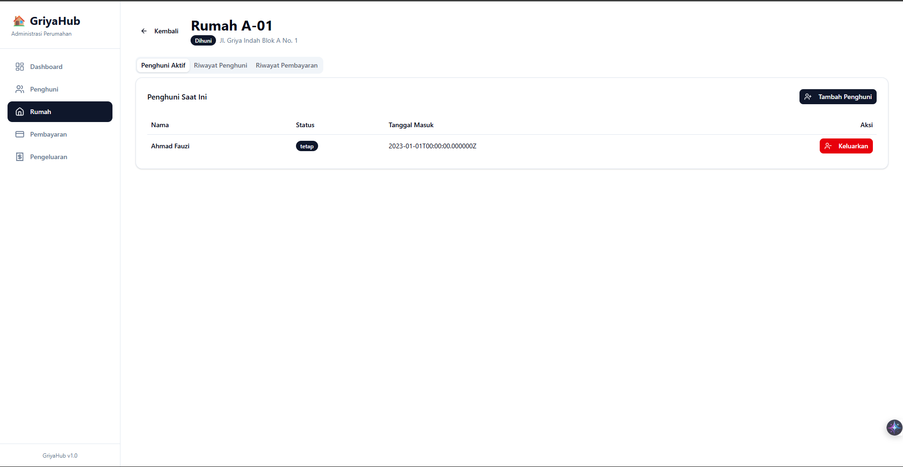

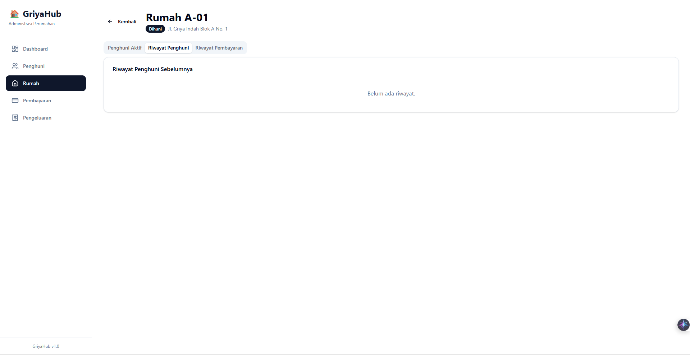

---

## 4. Kelola Pembayaran

### 4a. Daftar Pembayaran

Tabel semua pembayaran iuran dengan filter.

**Fitur:**
- Filter: Tahun, Bulan, Jenis Iuran (Satpam/Kebersihan), Status (Lunas/Belum Lunas)
- Tabel: Penghuni, Rumah, Jenis, Periode, Jumlah (Rp), Status
- Badge status lunas/belum lunas

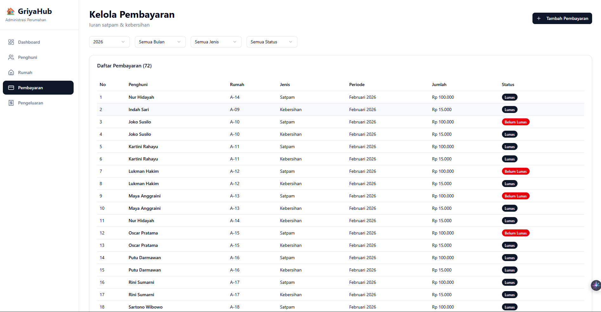

### 4b. Form Tambah Pembayaran

Form untuk mencatat pembayaran iuran baru.

**Fitur:**
- Pilih Penghuni & Rumah dari dropdown
- Jenis Iuran: Satpam (Rp 100.000) / Kebersihan (Rp 15.000) — auto-fill jumlah
- Periode: Bulanan / Tahunan (otomatis buat 12 bulan)
- Status: Lunas / Belum Lunas

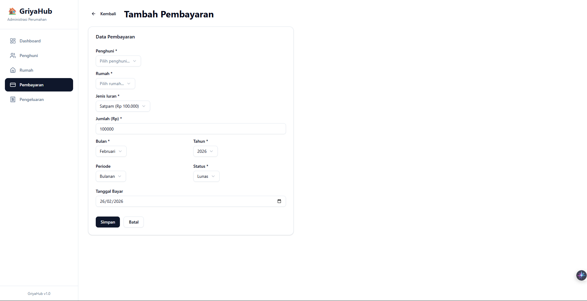

---

## 5. Kelola Pengeluaran

### 5a. Daftar Pengeluaran

Tabel semua pengeluaran operasional perumahan.

**Fitur:**
- Tabel: Kategori, Deskripsi, Jumlah (Rp), Tanggal, Rutin (Ya/Tidak)
- Tombol Tambah & Hapus

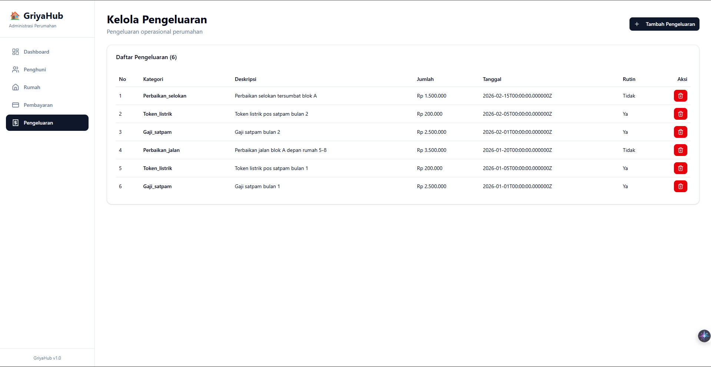

### 5b. Form Tambah Pengeluaran

Form untuk mencatat pengeluaran baru.

**Fitur:**
- Kategori: Gaji Satpam, Token Listrik, Perbaikan Jalan, Perbaikan Selokan, dll
- Input: Deskripsi, Jumlah, Tanggal, Flag Rutin/Tidak

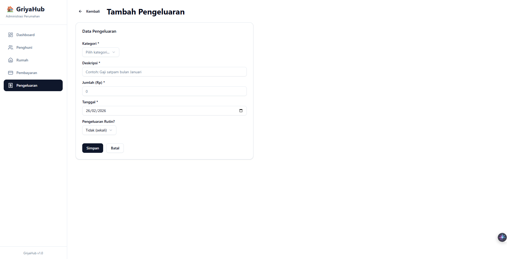

---

## Tech Stack

| Layer | Teknologi |
|-------|-----------|
| Backend | Laravel 10 (PHP 8.1+) |
| Frontend | React 19 + TypeScript + Vite |
| UI | shadcn/ui + Tailwind CSS 4 |
| Charts | Recharts |
| Database | MySQL |
| HTTP Client | Axios |
